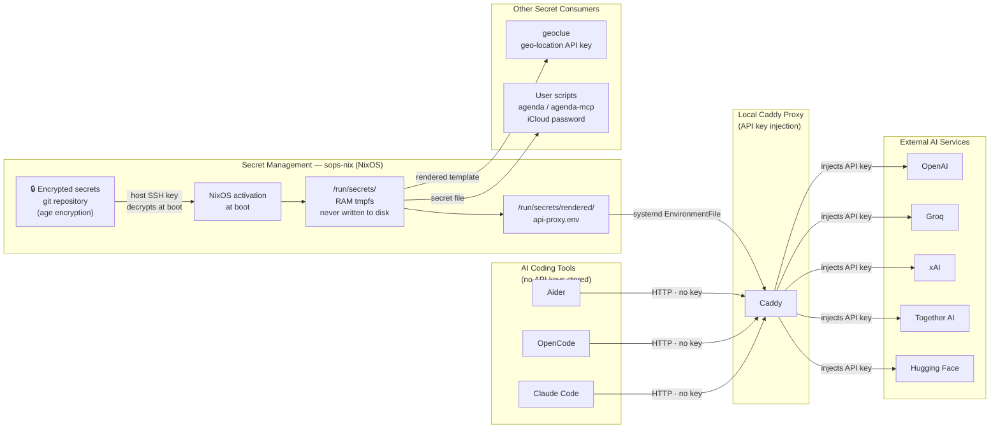

# Secret Management Architecture with sops-nix

**Key properties:**
- AI tools communicate with a **local proxy** — no API keys in tool configuration
- Secrets are **encrypted at rest** in the git repository (age encryption via sops)
- At boot, NixOS decrypts secrets into a **RAM-only tmpfs** (`/run/secrets/`) — never touches disk
- Caddy reads keys via **systemd `EnvironmentFile`** — keys are never exposed through the Caddy admin API
